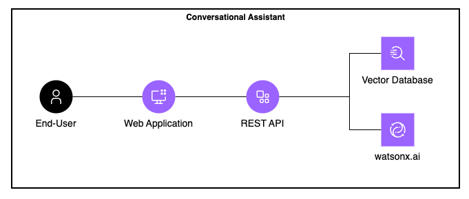

# Watsonx.ai - RAG Assistant Challenge

- [Watsonx.ai - RAG Assistant Challenge](#watsonxai---rag-assistant-challenge)
  - [1. Introduction](#1-introduction)
    - [1.1. About INCA Solutions](#11-about-inca-solutions)
    - [1.2. Business Challenge](#12-business-challenge)
  - [2. About the Solution](#2-about-the-solution)
    - [2.1. Application Architecture](#21-application-architecture)
    - [2.2. Repository Structure](#22-repository-structure)
    - [2.3. Functional Requirements](#23-functional-requirements)
    - [2.4. Implementation Considerations](#24-implementation-considerations)
  - [3. Vector Database Specifications](#3-vector-database-specifications)
  - [4. Environment Setup](#4-environment-setup)
    - [4.1. Prerequisites](#41-prerequisites)
    - [4.2. Docker Configuration](#42-docker-configuration)
    - [4.3. Environment variables](#43-environment-variables)
  - [5. Solution Delivery](#5-solution-delivery)
    - [5.1. Deliverables](#51-deliverables)
    - [5.2. Timeline and Communication](#52-timeline-and-communication)
  - [Useful References](#useful-references)
  - [Focal Points](#focal-points)
  - [Authors](#authors)

---

## 1. Introduction

### 1.1. About INCA Solutions

**INCA Solutions** is a leading technology company that provides digital transformation services across various industries in Latin America. As part of its innovation strategy, INCA Solutions recently adopted **Watsonx.ai**, an enterprise-grade studio for developing AI services and applications.

### 1.2. Business Challenge

Due to the continuous onboarding of new employees and the technical depth of Watsonx.ai, the company is facing an increasing need to support and train its workforce more efficiently. To address this challenge, INCA Solutions has decided to develop an **intelligent conversational assistant** capable of answering questions related to Watsonx.ai by leveraging its **official documentation**.

As part of this challenge INCA Solution has asked **you** a professional AI Engineer to develop this conversational assistant that answers questions about watsonx.ai platform by using non-other than the platform itself to host and serve the Foundational Models.

The expected outcome is a functional MVP of a RAG-based (Retrieval-Augmented Generation) conversational assistant that uses **IBM Watsonx.ai** to generate embeddings, perform inference, and optionally apply re-ranking—all while retrieving answers strictly from the provided documentation ([Unleashing the Power of AI with IBM watsonx.ai](/assets/Unleashing%20the%20Power%20of%20AI%20%20with%20IBM%20watsonxai.pdf)). The assistant should demonstrate how Watsonx.ai can be used to explain and support itself, effectively becoming a self-referential tool for onboarding and internal enablement. This solution will serve as a proof of concept to validate the feasibility of deploying Watsonx.ai internally to empower technical and non-technical users alike.

---

## 2. About the Solution

### 2.1. Application Architecture



The solution is expected to follow the **Retrieval-Augmented Generation (RAG)** architecture and support the following flow:

1. A user asks a question about Watsonx.ai.
2. The system generates embeddings of the question using **IBM Watsonx.ai**.
3. A semantic search is performed on a vector database containing indexed documentation.
4. Relevant document chunks are optionally re-ranked to enhance result precision.
5. The selected context is passed to a language model hosted on **Watsonx.ai** to generate the answer.
6. The answer is returned to the user via a console interface or an optional front-end.

---

### 2.2. Repository Structure

```
.
├── assets/               # Documentation Assets
├── images/               # Images used in the present document
├── source/               # Application source code
│   ├── back-end/         # Backend
│   └── front-end/        # Frontend
└── README.md             # Present document
```

### 2.3. Functional Requirements

The solution must meet the following requirements:

1. **Strict documentation-based answers**: The chatbot must rely solely on the provided documentation as its knowledge base. No hallucinated or pre-trained model answers should be returned.
2. **Use of IBM Watsonx.ai is mandatory**, specifically for:
   - Embedding generation
   - Language model inference
   - (Optional) re-ranking of retrieved documents
3. **Vector retrieval mechanism**:
   - The participant must index the official documentation.
   - The database must be loaded into memory at runtime.
4. **Optional UI**:
   - Participants are encouraged to implement a graphical user interface using Streamlit, React, or Angular to test the assistant.
5. **Optional Conversational capability**:
   - Maintaining context across multiple turns is not required but will be appreciated.

---

### 2.4. Implementation Considerations

- **Recommended language**: Python/FastAPI (though any programming language & framework may be used to develop both the REST API and UI).

- **Suggested frameworks/libraries**:
  - FastAPI, LangChain, Docling, Streamlit or any other fully custom implementations are acceptable.
  - A compatible client or SDK for **IBM Watsonx.ai** must be used to handle embedding generation, model inference, and optionally re-ranking.

- **Suggested vector databases** (in-memory or locally containerized database):
  - ChromaDB, Elasticsearch, Milvus, or any other efficient semantic search engine.

- **UI (optional)**:
  - If implemented, use a modern frontend framework such as Streamlit, React, or Angular.
  - The user interface must be in **English**. All user questions will be in **English**.

- **Security and development standards**:
  - All solutions must adhere to secure development and architectural best practices.
  - It is **mandatory** to follow secure coding guidelines as defined by the [OWASP Secure Coding Practices Quick Reference Guide](https://owasp.org/www-project-secure-coding-practices-quick-reference-guide/stable-en/02-checklist/05-checklist).
  - Sensitive data (e.g., API keys, Watsonx credentials) must never be hard-coded in the source code.
  - Use of environment variables (`.env` files) or a secure secrets manager is required.

- **Environment variables**:
  - Your solution must support the use of environment variables for configuration.
  - A sample `.env.example` file should be included.
  - Additional environment variables may be defined as needed.
  - Any required credentials (e.g., Watsonx API keys) will be securely provided to you.

- **Code structure and quality**:
  - The application must be cleanly structured, modular, and well-documented.
  - All source code must reside in a top-level `/source/` directory:
    - Backend services in `/source/back-end/`
    - Frontend (if present) in `/source/front-end/`
  - Subdirectories may be used freely as long as the organization is clear and well-explained in the `README.md`.

- **Containerization**:
  - All components must run inside Docker containers.
  - A working `Dockerfile` is required.
  - If your architecture involves multiple services (e.g., frontend and backend), a `docker-compose.yml` may be included.

---

## 3. Vector Database Specifications

No pre-built database will be provided. Participants are responsible for:

- Selecting an appropriate vector database.
- Converting and indexing the official Watsonx.ai documentation (specified below) using their preferred chunking strategy.
- Choosing the right embedding model.
- Defining the search type, filters and parameters.
- The vector database can run in memory or as a docker container.
- Implementing efficient and relevant document retrieval logic.
- Participants should not add any other documentation to the system vector database as the official document will be the only one use for testing the system.

> The official Watsonx documentation participants must use for the challenge is available in the assets folder under the name [Unleashing the Power of AI with IBM watsonx.ai](/assets/Unleashing%20the%20Power%20of%20AI%20%20with%20IBM%20watsonxai.pdf).
---

## 4. Environment Setup

### 4.1. Prerequisites

- Docker or Docker Desktop installed.
- Local environment capable of running containers.
- Access to IBM Watsonx.ai (API keys or credentials will be provided).
- Python 3.11+ (or compatible with chosen tech stack).

### 4.2. Docker Configuration

The project must include:

- A working `Dockerfile` that builds and runs the application.
- Optionally, a `docker-compose.yml` if multiple services are required.
- Clear build and run instructions in the `README.md`.
- The entire application must be runnable inside Docker containers.

### 4.3. Environment variables

Environment variables are dynamic values that can be stored and used by different processes on a Operative System (OS). They allow for values to be defined externally, without having to access the application's source code.

The application's environment variables are the following.

- `WATSONX_URL`. Secrets Manager instance URL.
- `WATSONX_PROJECT_ID`. Secrets Project Unique Identifier.
- `WATSONX_APIKEY`. Secrets Manager instance API Key.

> **Note:** This information will be provided to you via e-mail.

Once you have this information, you must create a `.env` file where your code is located. See the [`.example.env`](/source/back-end/.example.env) file for reference.

Afterwards, you must load those variables into your code.

---

## 5. Solution Delivery

### 5.1. Deliverables

Each participant must submit the following:

1. **Project source code**:
   - Complete and structured project repository.
   - A `README.md` file including:
     - Step-by-step installation and usage instructions.
     - Technical decisions and architecture explanation.
     - Integration details for IBM Watsonx.ai.
   - Code must be *submitted via e-mail*, by sending a `.zip` copy of your repository.
2. **Demo video (~10 minutes)**:
   - Overview of the challenge and solution.
   - System walkthrough and architecture overview.
   - Live example queries and system behavior.
   - Personal insights or lessons learned.
   - Video must be in `.mp4` format.
   - Language: English.
   - This video must be *sent via e-mail*. Do not include it as part of this repository.

### 5.2. Timeline and Communication

- The challenge is **fully remote**.
- Any questions can be sent to the designated contact point(s), which will be provided via email.

---

## Useful References

- [IBM Watsonx.ai](https://www.ibm.com/products/watsonx-ai)
- [IBM Watsonx.ai Python SDK](https://ibm.github.io/watsonx-ai-python-sdk/foundation_models.html)
- [FastAPI](https://fastapi.tiangolo.com/)
- [LangChain](https://python.langchain.com/docs/introduction/)
- [ChromaDB](https://www.trychroma.com/)

---
## Focal Points

Communication, both for questions and delivery purposes, must be sent to:

- `Gabriela Retamosa`. Client Engineering - Ecosystem | BTL - SSA & Mexico. [gabyretamosa@uy.ibm.com](mailto:gabyretamosa@uy.ibm.com)
- `Facundo Iraola`. Client Engineering - Ecosystem | AI Engineer - Project Lead (LATAM) [fid@ibm.com](mailto:fid@ibm.com)
- `Sebastian Fripp`. Client Engineering - Ecosystem | AI Engineer - Project Lead (LATAM) [sfripp@ibm.com](mailto:sfripp@ibm.com)
- `Nadia Dos Santos`. Client Engineering - Ecosystem | Platform Engineer - Project Lead (LATAM) [nadiadossantos@ibm.com](mailto:nadiadossantos@ibm.com)

---

## Authors

- [Facundo Iraola](www.linkedin.com/in/firaola). Client Engineering - Ecosystem | AI Engineer - Project Lead (LATAM).
